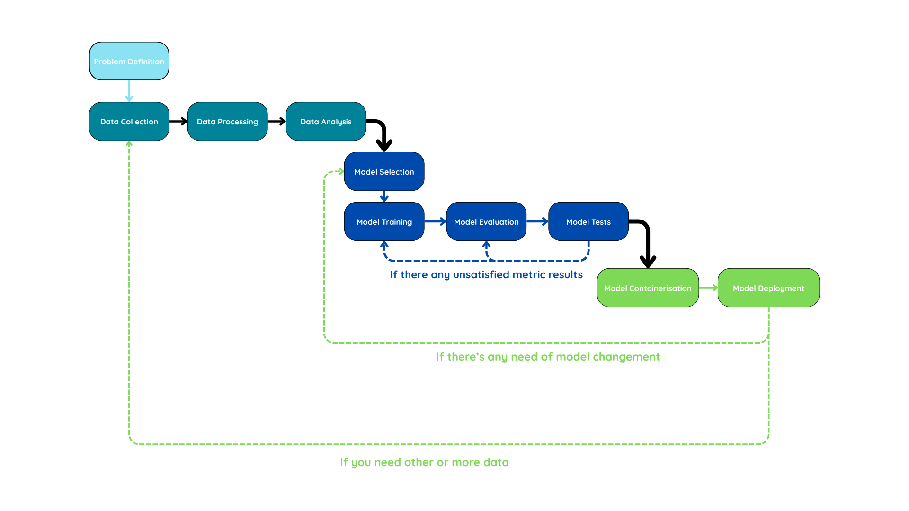

# PunchIQ AI

An AI solution that predicts the outcome of a boxing match based on the fighters' characteristics.

## Requirements

### Create a virtual environment

```bash
python -m venv myenv
```

### Activate the environment
- On `Windows`:
    ```bash
    .\myenv\Scripts\activate
    ```
- On `Linux` or `MacOS`:
    ```bash
    source myenv/bin/activate
    ```

### Install the required modules
```bash
pip install -r requirements.txt
```

## Launch Notebooks

1. Select a kernel/environment (the one which you created before)
2. Press the 'Run All' button or just run cases one by one

## Methodology

### AI Processus Schema



<!-- 
### Launch the solution

-->

